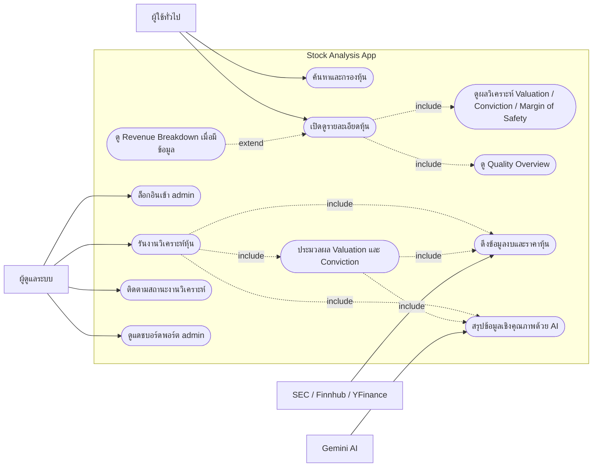

# Stock Analysis App

ระบบช่วยวิเคราะห์หุ้นเชิงลึกสำหรับนักลงทุนแนวคุณค่า โดยหน้าเว็บสาธารณะเน้นการค้นหาและเปิดดูผลวิเคราะห์หุ้นที่คำนวณไว้แล้ว ส่วนงานรันวิเคราะห์ ซิงก์ข้อมูล และแดชบอร์ดพอร์ตจะอยู่ในฝั่งผู้ดูแลระบบ (admin) เป้าหมายคือให้ภาพรวมที่โปร่งใส ทั้งข้อมูลเชิงปริมาณ เชิงคุณภาพ และมูลค่าที่แท้จริง (Intrinsic Value) โดยยึดหลัก Margin of Safety

## Public Edition Notice

- Repo บน GitHub นี้เป็นฉบับเผยแพร่สำหรับการเรียนและการรีวิวโค้ด
- Logic valuation บางส่วนถูกลดให้เป็น baseline ที่อ่านง่ายขึ้น โดยใช้ sector defaults และ exception เท่าที่จำเป็นต่อการทำงาน
- ดังนั้นผลลัพธ์จาก repo public อาจไม่ตรงกับ private working version หรือฉบับที่ใช้ทำโครงงาน 1:1
- ถ้าครูหรือกรรมการต้องตรวจโค้ดจริงเต็มชุด ควรดูจาก private thesis version แยกต่างหาก

## ไฮไลต์ฟีเจอร์
- ✅ **Pipeline วิเคราะห์อัตโนมัติ**: ดึงข้อมูล 10-K, ข้อมูลงบการเงิน และสรุปผลด้วย AI (Gemini) ภายใต้กฎตรวจสอบคุณภาพข้อมูล
- ✅ **หน้า Public Dashboard และ Stock Detail**: ค้นหา กรอง และเปิดดูผลวิเคราะห์หุ้นที่มีอยู่แล้วจากหน้าเว็บ
- ✅ **Checklist โปร่งใส**: เก็บผลการประเมินแบบ pass/fail ในรูป JSON และเปิดให้คลิกดูสูตรคำนวณสำคัญ
- ✅ **Admin Monitor สำหรับงานวิเคราะห์**: ผู้ดูแลระบบสามารถสั่งรันวิเคราะห์หุ้น ติดตามสถานะงาน และดู log ได้
- ✅ **Admin Portfolio Dashboard**: มีตารางจัดเก็บสถานะพอร์ต การทำธุรกรรม และ benchmark สำหรับผู้ดูแลระบบ

## ขอบเขตการใช้งานตามบทบาท
- **ผู้ใช้ทั่วไป**: ค้นหา/กรองหุ้น, เปิดดูหน้ารายละเอียดหุ้น, ดู Valuation, Conviction, Quality Overview และ Revenue Breakdown เมื่อมีข้อมูล
- **ผู้ดูแลระบบ (Admin)**: ล็อกอินเข้า `/admin`, รันงานวิเคราะห์หุ้น, ติดตามสถานะงานวิเคราะห์, และดูแดชบอร์ดพอร์ต

## Use Case Diagram


## สถาปัตยกรรมโดยสรุป
- **Frontend**: Next.js + React + Tailwind (โฟลเดอร์ `frontend/`)
- **Web API สำหรับหน้าเว็บ**: Next.js Route Handlers ใช้อ่านข้อมูลหุ้น/ผลวิเคราะห์จากฐานข้อมูลโดยตรง
- **Backend API เสริม**: FastAPI ยังอยู่ใน repo สำหรับงานฝั่ง Python และ endpoint บางส่วน
- **งานเบื้องหลัง (Backend Runner)**: ชุด job จัดคิวและวิเคราะห์หุ้น (`backend/unified_runner.py` + jobs ใน `backend/src/jobs/`)
- **ฐานข้อมูล**: PostgreSQL ผ่าน Database Connector
- **AI & ข้อมูลภายนอก**: Google Gemini API สำหรับสรุป 10-K, Finnhub สำหรับข้อมูลการเงิน, YFinance สำหรับราคาหุ้น
- **การจัดการไฟล์ SEC**: ดาวน์โหลดและดึงข้อมูลจาก EDGAR ของ ก.ล.ต. สหรัฐ

## โครงสร้างโปรเจ็กต์หลัก
```text
d:\stock-analysis-app
├─ backend/
│  ├─ api.py                     # FastAPI entry point
│  ├─ unified_runner.py          # Script หลักสำหรับวิเคราะห์หุ้นและ AI
│  └─ src/
│     ├─ analysis_engine/        # โมดูลคำนวณเชิงคุณภาพ/ปริมาณ/valuation
│     ├─ api_clients/            # ตัวห่อ API ภายนอก (SEC, Finnhub, YFinance)
│     ├─ jobs/                   # งาน background / cron
│     ├─ database/               # models, connectors
│     └─ utils/                  # helper modules ต่าง ๆ
├─ frontend/                     # Next.js app สำหรับส่วนแสดงผล UI (เว็บ)
├─ package.json                  # ไฟล์รวมชุดคำสั่งลัดสำหรับสั่งการโปรเจกต์
└─ README.md                     # เอกสารนี้
```

## การติดตั้งและใช้งาน (แบบง่าย)
> แนะนำให้ใช้ Python ≥ 3.10 และ Node.js ≥ 20 พร้อม PostgreSQL ที่รันอยู่

### 1. โคลนและสร้างห้องจำลอง Python
```bash
git clone <repo-url> stock-analysis-app
cd stock-analysis-app
python -m venv .venv

# เปิดใช้งาน (ตัวอย่างสำหรับ Windows PowerShell)
.\.venv\Scripts\activate
```

### 2. ตั้งค่า Environment Variables
- สร้างไฟล์ `.env` (คัดลอกรูปแบบจาก `.env.example`) เพื่อตั้งค่ารหัสผ่านฐานข้อมูลและ API Key ต่างๆ
- สร้างไฟล์ `frontend/.env.local` (คัดลอกรูปแบบจาก `frontend/.env.local.example`) สำหรับค่า env ของ Next.js
- ไฟล์ `.env.example` และ `frontend/.env.local.example` เป็นไฟล์ตัวอย่างที่ commit ได้ แต่ `.env` และ `frontend/.env.local` จริงไม่ควรถูก commit

### 3. ดาวน์โหลดโปรแกรมและไลบรารี
เพียงแค่พิมพ์คำสั่งลัดคำสั่งเดียว โค้ดจะจัดการดาวน์โหลดไลบรารีให้ทั้งส่วน Python และ Node.js ทันที:
```bash
npm run download
```

## การเปิดรันระบบทำงาน
เมื่อต้องการใช้งาน ให้เปิด Terminal ที่มีคิว `(.venv)` เปิดอยู่ แล้วพิมพ์คำสั่งลัดเหล่านี้ได้เลย:

**1. รันวิเคราะห์หุ้นด้วย AI (Backend Runner) 🤖**
รัน Script เพื่อสั่งให้บอทเริ่มดึงงบการเงินและวิเคราะห์หุ้น 
```bash
npm run back
```

**2. เปิดหน้าเว็บและระบบหลังบ้านทั้งหมด 🌐**
คำสั่งเดียวจบ! จะเปิดเซิร์ฟเวอร์เว็บและระบบเชื่อมต่อข้อมูล (API) ขึ้นมาพร้อมกันในหน้าจอเดียว
```bash
npm run dev
```
*(จากนั้นพิมพ์เปิดดูหน้าเว็บที่ `http://localhost:3000` ได้เลย)*

---

## การทดสอบและรายงาน

- `npm run test`
  รันชุด pre-commit เดิม: backend `pytest` + frontend `build` พร้อมสรุปผลที่ `backend/data/test-reports/precommit-summary-latest.md`
- `npm run test:e2e`
  รัน Playwright bot ให้กดหน้าเว็บ, เก็บ screenshot, เขียน JUnit/HTML report, และสรุปผลที่ `backend/data/test-reports/e2e-summary-latest.md`
- `npm run test:all`
  รันทั้งสองชุดข้างบนต่อเนื่องกัน และสรุปรวมที่ `backend/data/test-reports/all-tests-summary-latest.md`
- `npm run test:clean`
  ล้าง artifacts ใน `backend/data/test-reports`

ถ้าต้องการยิงเว็บ deploy แทน local build:

```bash
E2E_BASE_URL=https://your-deployed-site.example.com npm run test:e2e
```

หมายเหตุเรื่อง admin:
- e2e ปัจจุบันครอบเฉพาะ admin entry-point/login gate
- การล็อกอิน admin แบบ Google OAuth จริงยังไม่ได้ automate ใน Playwright จนกว่าจะมี test session/bootstrap ที่ปลอดภัย
- manual checklist สำหรับเอาไปใช้ในรายงานอยู่ที่ `docs/testing-checklist.md`

---

## License

โปรเจกต์นี้เผยแพร่ภายใต้ PolyForm Noncommercial 1.0.0

- อนุญาตให้นำไปใช้เพื่อการเรียน การทดลอง การวิจัย และงานของสถาบันการศึกษา
- ไม่อนุญาตให้นำไปใช้เชิงพาณิชย์โดยไม่ได้รับอนุญาตจากเจ้าของลิขสิทธิ์
- License นี้ตั้งใจให้ครอบ source code และเอกสารที่อยู่ใน repo นี้ เช่น `backend/`, `frontend/`, `scripts/`, `docs/` และ `README.md` เว้นแต่ไฟล์ไหนจะระบุเงื่อนไขอื่นไว้ต่างหาก
- dependency จาก `pip`/`npm`, third-party assets, และบริการภายนอกยังคงใช้ license/terms ของเจ้าของเดิม ไม่ได้ถูกเปลี่ยนตาม license ของ repo นี้
- ดูรายละเอียดเต็มที่ `LICENSE`

ถ้าโครงงานจบนี้มีเงื่อนไขสิทธิ์ร่วมกับมหาวิทยาลัย อาจารย์ที่ปรึกษา หรือผู้สนับสนุนภายนอก ควรตรวจสอบสิทธิ์ก่อนตั้ง repo เป็น public

---

## หมายเหตุ
- ข้อมูลชั่วคราวจาก AI และสถานะการวิเคราะห์จะถูกเก็บไว้ในโฟลเดอร์ `.cache/` หรือมีการลบอัตโนมัติเมื่อวิเคราะห์เสร็จ
- `frontend/.env.local` คือค่าของหน้าเว็บตอนรันบนเครื่องคุณ และ `DATABASE_URL` ตรงนี้ควรชี้ไปฐานข้อมูล dev/local ที่คุณต้องการให้หน้าเว็บอ่าน
- `.env` ฝั่ง root ใช้กับ Python runner; ถ้า `USE_DEPLOY_DB="off"` จะเขียนเข้า `DATABASE_URL`, ถ้า `USE_DEPLOY_DB="on"` จะเขียนเข้า `DATABASE_URL_DEPLOY`
- ถ้า deploy `frontend/` ขึ้น Vercel และใช้ Supabase ให้ตั้ง `DATABASE_URL_POOLED` เป็น connection string แบบ `pooled / Transaction mode` และตั้ง `PG_POOL_MAX=1` เพื่อลดปัญหา `MaxClientsInSessionMode`
- `PG_POOL_MAX=1` จำกัดจำนวน DB connections ต่อ Vercel instance ไม่ได้จำกัดจำนวน ticker ที่ admin ใส่ใน queue
- หน้า `admin/stocks-sync` เป็น admin-only และโค้ดปัจจุบันตั้งใจให้รัน Python job จากเครื่อง/worker ที่มี backend อยู่ ไม่ใช่จาก Vercel serverless
